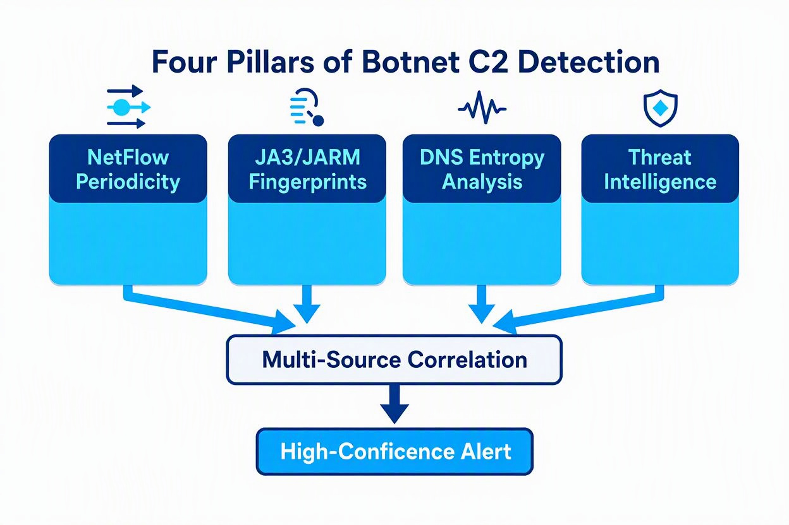

# From Architecture to Detection: A Defensive Analysis Field Guide to Modern Botnet C2 Communications

## Executive Summary

The key to botnet defense is **behavioral modeling, not decryption**. Modern C2 communications universally employ TLS encryption and protocol masquerading, making traditional signature-based and content-inspection methods obsolete. Effective defense rests on four pillars: periodic analysis of NetFlow data, JA3/JARM fingerprinting to characterize encrypted traffic, DNS query behavior analysis (entropy, length, frequency) to catch tunneling, and multi-source correlation to reduce false positives. This article moves from botnet architecture fundamentals through a systematic detection engineering methodology, and provides deployable Sigma rules alongside LinkedIn share templates.

---




## 1. The Nature of Botnets: Why They're Hard to Defend Against

A botnet is a collection of internet-connected devices, PCs, laptops, smartphones, servers, home routers, and virtually any networked endpoint; That are infected and controlled remotely by an attacker (the "bot herder"). The term combines "robot" and "network."

The fundamental reason botnets are so difficult to counter lies in their **distributed architecture**: the attacker disperses malicious tasks across thousands of compromised devices, creating enormous aggregate bandwidth and a massive pool of attack sources. A botnet of 50,000 infected machines, each contributing even just 50 kbps of upload bandwidth, can generate roughly 300 MB/s of aggregate traffic, enough to saturate a major enterprise's internet pipe.

Primary malicious uses of botnets include:

- **DDoS attacks** — leveraging many bots to simultaneously send requests, exhausting the target's CPU, bandwidth, and memory
- **Spam and phishing** — forwarding bulk phishing emails through bots to evade blocklists
- **Cryptomining** — using compromised devices' compute to mine cryptocurrency
- **Data theft** — harvesting credentials, financial data, and sensitive information
- **Click fraud** — simulating legitimate user clicks to generate revenue for the attacker

---

## 2. The Evolution of C2 Architecture: From IRC to Encrypted Channels

At the heart of every botnet is its Command and Control (C2) communications. The C2 server is the hub from which the botmaster sends commands and code updates. Because firewalls block inbound connections, the botmaster cannot contact devices directly, malware typically initiates the connection to the C2 and receives instructions.

### 2.1 Traditional Architecture: IRC Control

Early botnets used IRC (Internet Relay Chat) as their control channel. Bots connected to a predefined IRC server (often port 6667), logged into a specific channel, and waited for commands. Agobot, GTBot, and SDBot were notable IRC botnets. The IRC architecture had a clear weakness: a fixed port, a fixed server address, and a fixed connection interval made the pattern easy to detect.

### 2.2 Modern Architecture: Encrypted C2 and Protocol Masquerading

Modern botnets have evolved dramatically. **Linux/Moose**, a botnet targeting embedded Linux devices and consumer routers, illustrates significant architectural evolution: early variants used hardcoded infrastructure and a binary protocol, while later variants shifted to encrypted command-line configuration and embedded ASCII-printable data into HTTP headers for masquerading.

**Eternity Botnet** demonstrates modular design: it allows attackers to launch DDoS attacks via HTTP, TCP Flood, or UDP Flood, and drops files on infected hosts with UAC bypass. Its MITRE ATT&CK mapping shows tactics including T1105 (Ingress Tool Transfer) and T1498 (Network Denial of Service).

More covert is the **Doki** backdoor, which uses a Dogecoin blockchain-based Domain Generation Algorithm (DGA) to generate C2 domains and communicates with C2 over HTTPS (T1071.001). This design renders traditional domain blocklists entirely ineffective, the C2 address is dynamically generated and cannot be pre-emptively blocked.

### 2.3 P2P and Decentralized Architectures

Modern botnets increasingly adopt P2P architectures to eliminate single points of failure. In a decentralized C&C architecture, the botnet operates on a peer-to-peer basis with no central server that can be sinkholed or shut down. This means defenders cannot dismantle the entire network by taking down one C2 server. Graph-based methods are used to model communication topologies, and research shows topology detectors can achieve high F1 scores on benchmarks-though this remains research-grade evidence.

---

## 3. Core Detection Engineering Methodology: Behavioral Modeling, Not Decryption

Faced with encrypted C2 traffic, traditional content-based detection has failed. The principle of **"modeling C2 behavior rather than decrypting it"** underpins the entire modern detection engineering stack.

### 3.1 Periodicity (Beaconing) Analysis: The Most Reliable Signal

Beaconing is the most prominent behavioral characteristic of C2 communication. Malware must "check in" periodically to receive new instructions, and this rhythmic heartbeat pattern is a core detection lead.

**Key detection parameters**:

| Parameter | Typical Threshold | Description |
|-----------|-------------------|-------------|
| Interval regularity | Jitter < 10% of mean | Low variance indicates automated beaconing |
| Minimum queries | > 50 to the same domain | Enough data for statistical analysis |
| Time span | > 1 hour | Beacons must persist over time |
| Query size consistency | Std dev < 5 bytes | Uniform tunnel payload size |
| Nighttime activity | Present | Activity outside business hours |

Tools like C2Sentinel combine network behavioral analysis with IP/domain validation (against malware repositories) to successfully detect hidden communications, identifying beaconing as an indicator of C2 activity.

### 3.2 JA3/JARM Fingerprinting: "Fingerprinting" Encrypted Traffic

When C2 communication uses TLS, the content is invisible, but the TLS handshake characteristics remain exposed. JA3 extracts TLS version, cipher suites, extensions, and other fields from the Client Hello to generate an MD5 fingerprint. JA4+ is its successor.

**Practical application**: Cobalt Strike beacon detection can be achieved through JA3 and JARM fingerprints. The detection logic includes:

- Establishing a baseline of normal fingerprints in the environment (browsers and management apps typically produce only a handful of JA3 values)
- Confidence scoring for rare fingerprints: the score rises when a rare JA3 appears on a workstation alongside a suspicious JARM, a newly registered domain, and an anomalous outbound process
- Correlating endpoint telemetry: checking parent process, command line, user context, and recent script activity

**Important caveat**: TLS parameters undergo "parameter drift" with version upgrades. For example, when Trickbot moved from TLS 1.0 to 1.2, nearly all cipher suites were replaced and TLS extensions grew from 3 to 8. This means fingerprint baselines must be updated regularly.

### 3.3 DNS Tunnel Detection: Entropy Is the Strongest Signal

DNS is an ideal choice for attackers establishing covert channels because it is "usually not blocked by firewalls." DNS tunneling is widely used for C2 and unauthorized VPNs.

**Shannon entropy thresholds**:

| Entropy Range | Classification | Typical Source |
|---------------|---------------|----------------|
| 2.0 – 3.0 | Normal | Common English domain labels |
| 3.0 – 3.5 | Elevated | Long or mixed-case labels |
| 3.5 – 4.0 | Suspicious | Hex encoding, base32, DGA |
| 4.0 – 4.5 | High | DNS tunnels (Iodine, dnscat2) |
| 4.5+ | Very high | Encrypted or base64-encoded payloads |

**Known tunneling tool signatures**:

- **Iodine**: Base32/Base64 encoding, long alphanumeric subdomains (50+ chars), entropy 3.8–4.2
- **dnscat2**: Hex encoding, encrypted, consistent query intervals
- **dns2tcp**: Base32 strings (20+ chars), uses KEY record type
- **Cobalt Strike DNS Beacon**: Short hex strings (8–20 chars), regular beacon interval (default 60s)
- **Sliver DNS C2**: High variance in subdomain length, mixed record types

**DGA feature extraction**: Beyond entropy, one can compute label length (>15 chars is anomalous), consonant ratio (>0.7), digit ratio (>0.3), and dictionary word presence.

### 3.4 NetFlow Analysis and ML Assistance

NetFlow data provides traffic-level visibility. One effective approach analyzes data from the **C2-centric perspective**: aggregating traffic between each external host IP and all associated internal device IPs, then using a machine learning model to predict whether that external IP is a C2.

The advantage over per-device analysis is that C2 servers are designed to control many bots, so control behavior manifests in the interaction data between the C2 and devices, aggregated analysis provides richer features and fewer samples.

**But beware the ML benchmark trap**: A 2024 study reported an FPR of just 1.53% on the IoT-23 dataset. But this is a controlled laboratory dataset, not a production network. In a mid-sized enterprise with a million flows per day, 1.53% means roughly 15,300 false positives per day, a volume no SOC can handle. ML results should be understood as "fit to a benchmark, not performance on live enterprise traffic."

---

## 4. Deployable Detection Rules

### 4.1 Sigma Rule: Uncommon Destination Port Connection Detection

The following rule detects programs connecting to uncommon C2 ports (8080, 8888), excluding local and system directory traffic:

```yaml
title: Communication To Uncommon Destination Ports
id: [rule-id]
status: test
description: Detects programs that connect to uncommon destination ports
references:
    - https://docs.google.com/spreadsheets/d/17pSTDNpa0sf6pHeRhusvWG6rThciE8CsXTSlDUAZDyo
author: Florian Roth (Nextron Systems)
date: 2017-03-19
modified: 2024-03-12
tags:
    - attack.persistence
    - attack.command-and-control
    - attack.t1571
logsource:
    category: network_connection
    product: windows
detection:
    selection:
        Initiated: 'true'
        DestinationPort:
            - 8080
            - 8888
    filter_main_local_ranges:
        DestinationIp|cidr:
            - '127.0.0.0/8'
            - '10.0.0.0/8'
            - '172.16.0.0/12'
            - '192.168.0.0/16'
            - '169.254.0.0/16'
            - '::1/128'
            - 'fe80::/10'
            - 'fc00::/7'
    filter_optional_sys_directories:
        Image|startswith:
            - 'C:\Program Files\'
            - 'C:\Program Files (x86)\'
    condition: selection and not 1 of filter_main_* and not 1 of filter_optional_*
falsepositives:
    - Unknown
level: medium

```
### 4.2 Dynamic Threat Intelligence Pipeline (RSigma)

Static Sigma rules decay over time. RSigma's dynamic pipeline feature allows threat intelligence feeds to be wired into rules at runtime **without modifying the rules themselves**.

A demonstration repository showcases two data sources:

- **Feodo Tracker** (HTTP): refreshes every 5 minutes for Emotet, Dridex, TrickBot, QakBot C2 IPs
- **CISA AA25-141B advisory** (Command): extracts roughly 114 LummaC2 C2 domains via ioc-finder

The pipeline YAML declares sources; the `vars` section maps parsed data to template variables; `value_placeholders` transforms replace placeholders in rules with resolved values.

### 4.3 Suspicious TLD Connection Detection

Attackers frequently abuse low-cost or high-anonymity TLDs (.top, .xyz, .ml, .cf) to host malicious infrastructure. Monitoring GenAI tools and CLI package managers for connections to these TLDs serves as a high-fidelity indicator:

```yaml
title: GenAI Process Connection to Suspicious TLD
logsource:
    category: network_connection
detection:
    selection_process:
        Image|endswith:
            - '\python.exe'
            - '\node.exe'
            - '\npm.exe'
            - '\pip.exe'
    selection_domain:
        DestinationHostname|endswith:
            - '.top'
            - '.xyz'
            - '.ml'
            - '.cf'
    condition: selection_process and selection_domain
tags:
    - attack.command-and-control
    - attack.t1071.004
level: medium

```
Authorized AI services typically use reputable domains (.com, .ai, .io), so connections from these processes to suspicious TLDs are high-confidence signals of anomalous behavior.

---

## 5. Closing the Loop: From C2 Detection to Victim Identification

Identifying C2 infrastructure is only half the problem. The more valuable question is: **which internal systems are communicating with that infrastructure?**

Team Cymru's Total Insights Feed employs a behavioral labeling approach. Once an IP is identified as C2 infrastructure, the system evaluates NetFlow observations for sustained, high-confidence interaction with that controller. When behavior meets analytical criteria, communicating IPs may be labeled as "likely bots" associated with a malware family.

This creates two practical workflows:

1. Security teams can check their organization's IP ranges against the Total Insights Feed to identify systems possibly communicating with known malicious controllers
2. Analysts investigating a controller can view associated bot labels to identify potential downstream victims

Key caution: these observations should not be treated as definitive proof of compromise, but as high-value investigative leads that help teams prioritize validation, containment, and response. Visibility is foundational. Only broader and more representative telemetry enables analysts to assess infrastructure behavior with confidence over time.

---

## 6. Summary of Defensive Recommendations

**Detection engineering level:**

1. **Establish baselines**: baseline normal JA3/JARM fingerprints, DNS query patterns, and NetFlow traffic in the environment, separately for user workstations, servers, and security appliances
2. **Multi-layer correlation**: a single signal (e.g., a rare JA3) is insufficient, correlate endpoint telemetry, DNS queries, process lineage, and user behavior
3. **Periodicity analysis**: implement beaconing detection on NetFlow data, focusing on interval regularity, query size consistency, and nighttime activity
4. **DNS entropy monitoring**: implement Shannon entropy threshold alerting on DNS queries, with particular focus on the 3.5 - 4.5 range
5. **Dynamic intelligence**: use RSigma dynamic pipelines or similar mechanisms to wire real-time threat intelligence feeds into detection rules

**Architecture level:**

1. **Network segmentation**: restrict outbound connections from internal systems, especially to non-standard ports
2. **DNS control**: deploy DNS tunnel prevention technology (e.g., TunTight) to block tunnels at first query
3. **TLS visibility**: implement TLS inspection where compliance permits, or at minimum log JA3/JARM fingerprints
4. **Unmanaged device coverage**: IoT devices have no endpoint agent, the network is the only detection point

**Human factors:**

1. **Realistic benchmark awareness**: high accuracy on a laboratory dataset does not equal production performance; base rate is the decisive factor in false positive volume
2. **Continuous tuning**: TLS version upgrades and application updates change fingerprint baselines; detection rules require regular review

---

## Conclusion

Botnet defense is undergoing a paradigm shift from "content detection" to "behavioral modeling." Encrypted C2 communications make decryption neither feasible nor necessary. Periodic beaconing intervals, TLS handshake fingerprints, and DNS query entropy characteristics are **metadata** that reveal malicious intent more effectively than content itself.

The core challenge in detection engineering is not technology but the **signal-to-noise ratio**. A model achieving 99% accuracy in the lab may produce unacceptable false positive volumes in an enterprise environment. Effective detection requires precise baselines, multi-source correlation, and continuous tuning.

Ultimately, the goal of botnet detection is not to perfectly catch every bot, but to **shorten the response time from infrastructure discovery to victim identification before the attacker causes material harm**.