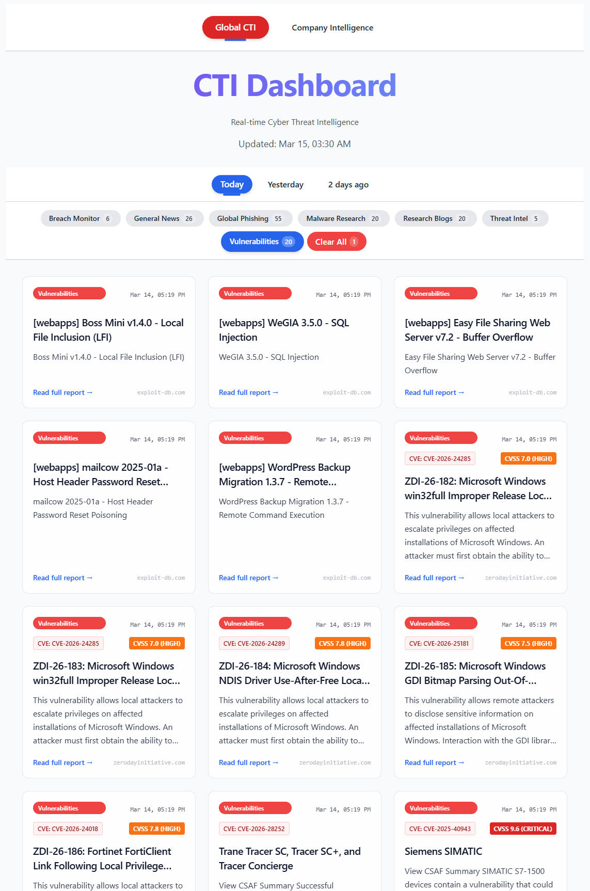
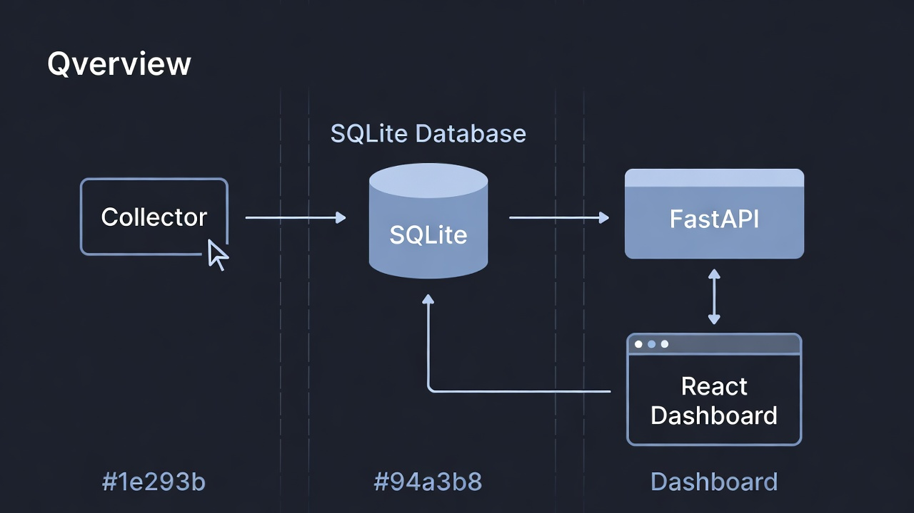
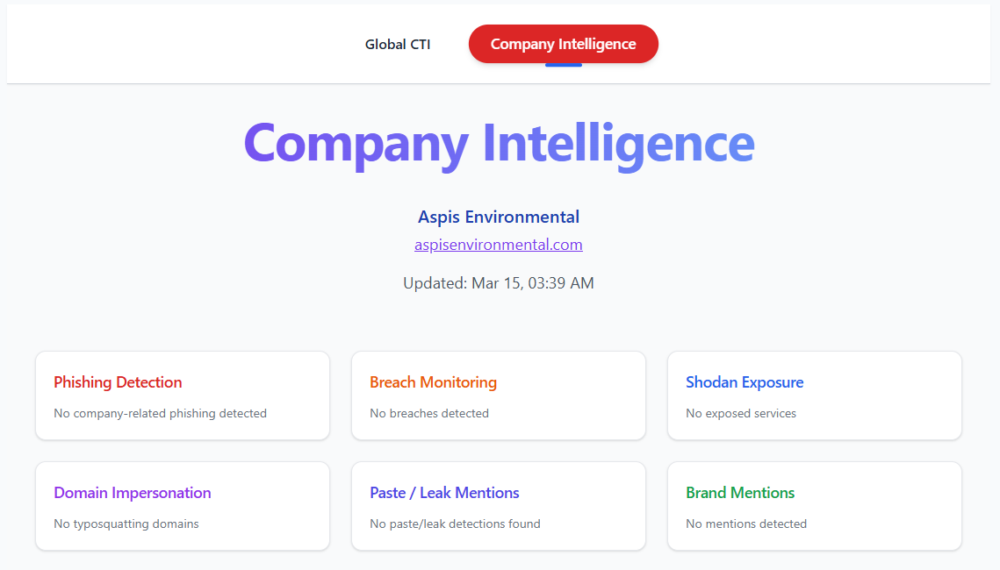

<nav style="text-align:right; font-size:0.9rem; margin-bottom:20px;">
  <a href="index.html"> Home</a> |
  <a href="/blog.html">Blog</a> |
  <a href="/contact.html">Contact</a> |
  <a href="/resume.html" target="_blank">Resume</a>

</nav>

---

# CTI-Lab: From Information Overload to Actionable Threat Intelligence

In today’s fast-paced digital world, cyber threats don’t wait — they evolve constantly. Ransomware campaigns, credential leaks, phishing kits, domain impersonation, and zero-day exploits appear daily. For security professionals, researchers, and organizations, the challenge isn’t finding data — it’s **turning noise into signal**.

For months I lived in tab chaos: RSS readers, Shodan searches, Have I Been Pwned lookups, NVD feeds, paste sites, and threat blogs. I wanted one place that:

- Automatically collected fresh intelligence 24/7  
- Filtered global threats and highlighted risks to *my* organization  
- Provided context (severity, MITRE mapping, enrichment)  
- Offered a clean, modern dashboard I could actually use daily  

So I built **CTI-Lab** — a complete, self-hosted Cyber Threat Intelligence dashboard that runs locally on my machine.

This is the story of why it exists, how it works, and how it can help you too.

## Why I Built CTI-Lab

Most existing tools suffer from one or more of these problems:

- Too much noise — global feeds bury company-relevant alerts  
- No persistence — close the tab and the intel is gone  
- Manual effort — daily checking is exhausting and error-prone  
- Lack of focus — little filtering for brand/domain/email risks  
- Fragmented views — no single pane for global + targeted intelligence  

I wanted a system that:

- Ran autonomously  
- Combined global and company-specific monitoring  
- Enriched data automatically (CVSS, CVE, MITRE tags)  
- Looked good and felt fast  

CTI-Lab solves exactly that.


  
*Global threat feed with enriched CVE/CVSS data*

## Architecture at a Glance

CTI-Lab is a full-stack application with three clean layers:

- **Collector** (`app/collector.py`)  
  Runs every 2 hours via scheduled loop. Pulls from 30+ sources: RSS, CISA KEV, NVD, ZDI, Exploit-DB, Shodan, phishing feeds, breach checks, paste sites, web mentions.

- **Backend** (`app/api.py`)  
  FastAPI + SQLite. Exposes `/articles`, `/company-info`, `/company-intel`. Handles deduplication, ISO 8601 UTC timestamps, NVD enrichment.

- **Frontend** (`ui/` folder)  
  React + Vite + Tailwind CSS. Responsive dashboard with global/company views, category filters, dark mode, clean cards.

Everything is local. No cloud. Full control. Zero external dependencies beyond API keys you choose.

  
*Collector → SQLite → FastAPI → React dashboard*

## Key Features

| Feature                          | Description                                                                 |
|----------------------------------|-----------------------------------------------------------------------------|
| Global Threat Feeds              | RSS (THN, Krebs, BleepingComputer), CISA KEV, NVD, ZDI, Exploit-DB          |
| Company-Specific Alerts          | Phishing, breaches (HIBP + DeHashed), Shodan exposures, paste/leak mentions, web mentions |
| Automatic Enrichment             | CVE extraction + CVSS scores from NVD API                                  |
| MITRE ATT&CK Tagging             | Keyword-based mapping to common techniques (expandable)                    |
| Paste & Leak Monitoring          | Multi-source scanning (LeakCheck, DDG → Pastebin fallback)                 |
| Modern Dashboard                 | React + Tailwind, dark mode, filters, responsive design                    |
| One-Command Startup              | `npm run dev:all` launches collector, API, and frontend simultaneously     |

 
*Company-focused alerts: phishing, breaches, Shodan, paste detections*

## Benefits of Using CTI-Lab

**Proactive Defense**  
Early warning system for brand/domain/email impersonation, credential leaks, and exposed assets. 

**Time Savings**  
Automates collection and filtering — hours saved per week.

**Centralized Visibility**  
One dashboard instead of 15 tabs and tools.

**Actionable Insights** 
Company-specific alerts let you respond directly to risks targeting your organization  


**Cost-Effective**  
Built on open-source tools + free-tier APIs (Shodan, NVD). Optional paid HIBP.

**Customizable**  
Easily add feeds, keywords, alerts, or new enrichment logic.

**Learning & Portfolio Value**  
Full-stack security project showing Python, FastAPI, React, scraping, scheduling, CTI workflows.

## Technical Highlights & Lessons Learned

- **SQLite** — perfect for local, zero-config persistence  
- **NVD API** — automatic CVSS/CVE enrichment  
- **Multi-source resilience** — strict DeHashed + free fallbacks (Firefox Monitor, LeakCheck)  
- **Polite scraping** — User-Agent rotation, delays, fallbacks  
- **Clean config** — `.env.example` + `.gitignore` make onboarding easy  

Biggest lesson: **Automation turns passive reading into active defense**.

## Getting Started

```bash
# Clone
git clone https://github.com/ewanoleghe/cti-lab.git
cd cti-lab

# Python backend
python3 -m venv .venv
source .venv/bin/activate
pip install -r requirements.txt

# Configuration
cp .env.example .env
# Edit .env → add API keys, company name, domain, keywords, emails

# Frontend
cd ui
npm install
cd ..

# Run everything
npm run dev:all

```


**Open Dashboard:** [http://localhost:5173](http://localhost:5173)  
**API Docs:** [http://localhost:9000/docs](http://localhost:9000/docs)  

> Wait 2–5 minutes for the first collector run → then refresh.

---

## Security Best Practices

- Never commit `.env` (already gitignored)  
- Rotate API keys periodically  
- Backup `cti_lab.db` securely  
- Run in isolated environment/VM if paranoid  
- Use minimal API scopes when possible

---

## Future Plans

- AI summarization & IOC extraction (local Ollama)  
- Real-time alerting (Slack, Discord, email)  
- Full MITRE ATT&CK Navigator view  
- Docker Compose + one-file deployment  
- Public live demo (once stable)

---

## Conclusion

CTI-Lab started as a personal frustration project and became a daily tool that gives me real-time visibility into both the global threat landscape and risks targeting my organization.  

It proves that powerful, focused threat intelligence doesn’t require expensive commercial platforms — sometimes the best solution is the one you build yourself.  

The code is open-source and available here:  
[https://github.com/ewanoleghe/cti-lab](https://github.com/ewanoleghe/cti-lab)

Questions, feedback, collaboration? Reach out via my portfolio:  
[https://ewanoleghe.github.io/](https://ewanoleghe.github.io/)  

I’d love to hear how you use it or what you’d like to see next.  

Stay safe, stay vigilant.  

— **Ewan Oleghe**  
*March 15, 2026*
