<nav style="text-align:right; font-size:0.9rem; margin-bottom:20px;">
  <a href="../../index.html">Home</a> |
  <a href="../../blog.html">Blog</a> |
  <a href="../../contact.html">Contact</a> |
  <a href="../../resume.html" target="_blank">Resume</a>
</nav>

---

# **AZURE: Microsoft Sentinel Honeypot & Attack Monitoring Lab**

## **Summary**
This project demonstrates the design and deployment of a cloud-based honeynet in **Microsoft Azure**, integrated with **Microsoft Sentinel** for real-time attack detection, threat intelligence enrichment, and global telemetry visualization.  

A publicly exposed Windows VM was intentionally configured with weakened firewall and network security controls to attract real adversary activity from the internet. Logs were collected using the Azure Monitoring Agent and correlated within Sentinel for threat hunting, mapping attacker geolocation, and building security analytics.

*Published on November 20, 2025 by **Ewan Oleghe**.*

---

## **Introduction**

This hands-on security project focuses on building a realistic **Security Operations Center (SOC) home lab** using Azure services.  
The goal was to:

- Deploy a vulnerable Windows VM on Azure  
- Expose it to the internet to attract live attack traffic  
- Ingest logs into **Log Analytics Workspace**  
- Enable **Microsoft Sentinel** to monitor, analyze, and visualize attacker behavior  
- Build custom KQL queries, alert rules, dashboards, and watchlists  
- Map global brute-force attempts using threat-intel and GEO-IP data  

The lab simulates real-world SOC workflows such as threat detection, log analysis, alerting, correlation, and visualization, allowing practical blue-team experience with Azure-native tools.

---

## **Introduction**

<ul style="font-size:80%">
  <li>Set-up a New Azure account or</li>
  <li>Log-in to Azure portal : https://portal.azure.com/</li>
</ul>

---
### **Step 1: Create a Resource Group**
The local container that groups everything related to one project (e.g., VM, VNet, NIC, Public IP).

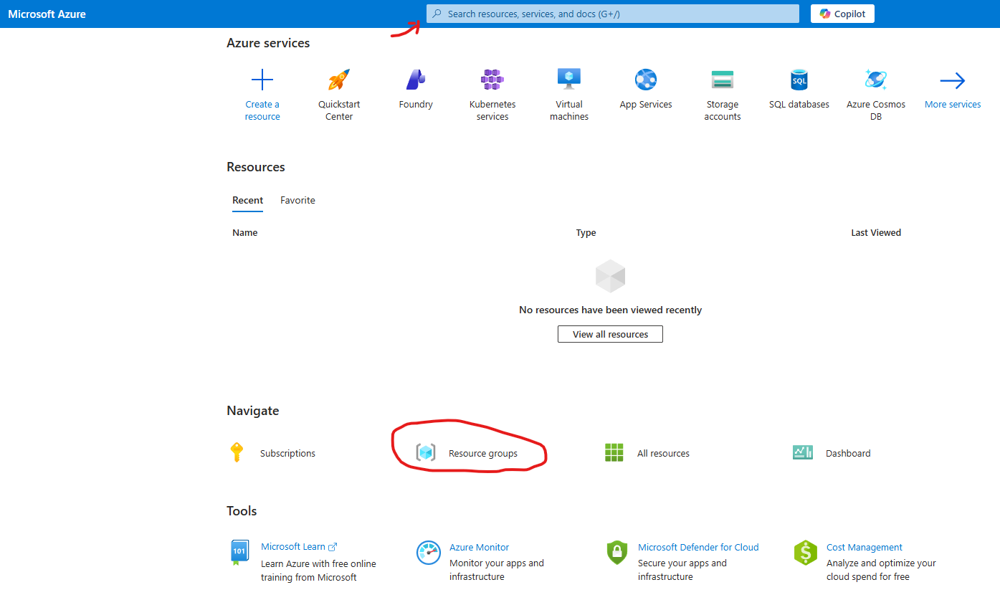
<ul style="font-size:80%">
  <li>Use the search bar or</li>
  <li>Select resource Groups in the Navigate section</li>
  <li>Create a Resource group
    <ul>
      <li>Subscription: Select your subscription</li>
      <li>Resource group: Name your resource group (e.g., H-SOC-Lab)</li>
      <li>Region: Select a region close to you (e.g., East US)</li>
      <li>Review and Create</li>
    </ul>
  </li>
</ul>

### **Step 2: Create a Virtual Network (VNets)**
The VNets a private, customizable network allows us to connect and secures resources. Our Virtual Machine will be placed inside the Virtual Network
<ul style="font-size:80%">
  <li>Use the search bar or</li>
  <li>Select Virtual networks - under Services</li>
  <li>Create virtual network
    <ul>
      <li>Subscription: Select your subscription</li>
      <li>Resource group: H-SOC-Lab</li>
      <li>Virtual network name (e.g., VNet-SOC-Lab)</li>
      <li>Region: Select a region close to you (e.g., East US)</li>
      <li>Review and Create</li>
    </ul>
  </li>
</ul>

### **Step 3: Create a Virtual Machine (VM)**
In Microsoft Azure, a VM is a cloud-hosted computer - This is what will be exposed to the Internet/attackers.
<ul style="font-size:80%">
  <li>Use the search bar or</li>
  <li>From the Home page, Select 'Virtual Machines' in Azure services section</li>
  <li>Create a Virtual Machine
    <ul>
      <li>Select Virtual Machine</li>
      <li>Resource group: H-SOC-Lab</li>
      <li>Virtual machine name: (e.g., CORP-US) - do not use honeypot- attachers can easily resolve the name to the IP</li>
      <li>Region: Select a region close to you (e.g., East US)</li>
      <li>Image: Windows 10 or 11 or any other Windows OS</li>
      <li>Size: (Chose a small machine to manage cost)</li>
      <li>check - confirm I have an eligible Windows 10/11 license</li>
      <li>-> Next: Disk
        <ul>
        <li>OS disk type: Select a small disk or HDD</li>
        </ul>
      </li>
      <li>-> Next: Networking
        <ul>
        <li>Virtual network: 'VNet-SOC-Lab'</li>
        <li>Subnet: 'default'</li>
        <li>Check: 'Delete public IP and NIC when VM is deleted'</li>
        </ul>
      </li>
      <li>-> Next: Management</li>
      <li>-> Next: Monitoring
      <ul>
        <li>Boot diagnostics - Check: 'Disable'</li>
        </ul>
        </li>
      <li>-> Next: Advanced</li>
      <li>-> Next: Review & Create</li>
      <li>-> Next: Create</li>
    </ul>
  </li>
</ul>

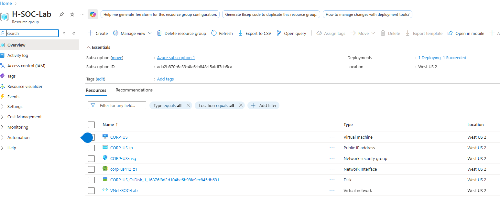

### **Step 4: Configure Network Security Group (NSG) Rules**
The NSG acts as a virtual firewall to control inbound and outbound traffic to the VM. We will create rules to allow specific traffic to the honeypot VM.

<ul style="font-size:80%">
  <li>Inbound Security rules: Delete the default RDP</li>
  <li>Set-up new traffic rule that allows inbound to all protocol
    <ul>
        <li>Go to Settings > Inbound security rules > + Add</li>
        <li>Source: Any</li>
        <li>Source port ranges: * (all)</li>
        <li>Destination: Any</li>
        <li>Service: Custom</li>
        <li>Destination port ranges: *</li>
        <li>Protocol: Any</li>
        <li>Action: Allow</li>
        <li>Priority: 100</li>
        <li>Name: Danger_vm_inboubd</li>
    </ul>
      </li>
</ul>

### **Step 5: Log-in to VM**
<ul style="font-size:80%">
  <li>RDP</li>
    <ul>
        <li>Log-in to VMM and disable the internal firewall on the VM</li>
        <li>Use RDP to login to the VM</li>
        <li>Primary NIC public IP: 20.64.238.22</li>
    </ul>
      </li>
</ul>

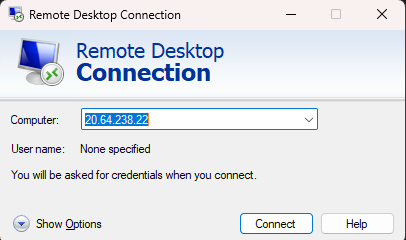

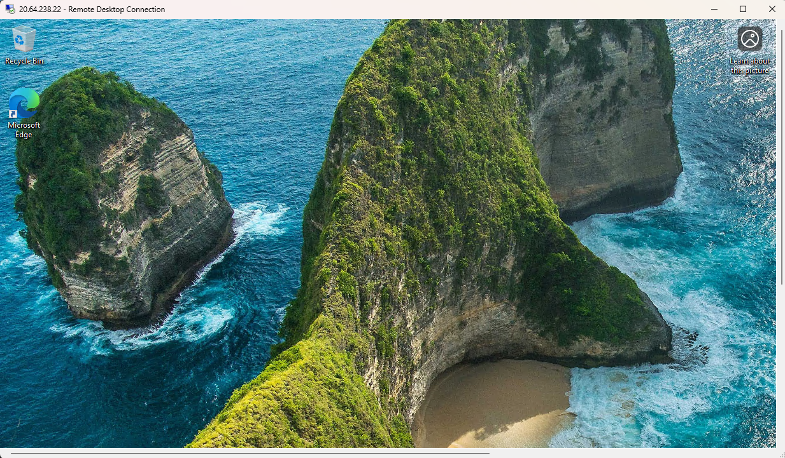


<ul style="font-size:80%">
  <li>Turn off Windows Firewall</li>
    <ul>
        <li>on the Vm search for 'wf.msc</li>
    </ul>
      </li>
</ul>

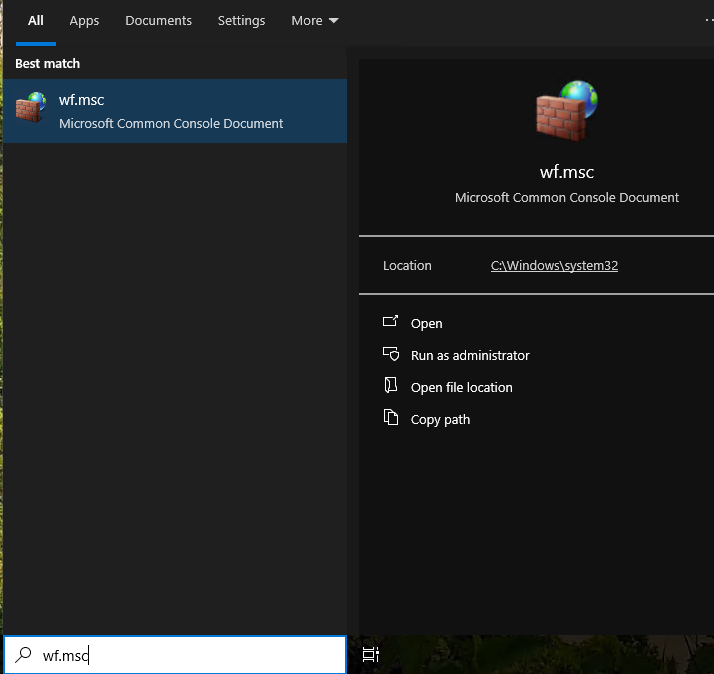

<ul style="font-size:80%">
  <li>Click : Windows Defender Firewall Properties and Turn off Firewall for each profile (Domain, Private and Public profiles) </li>
 </ul>

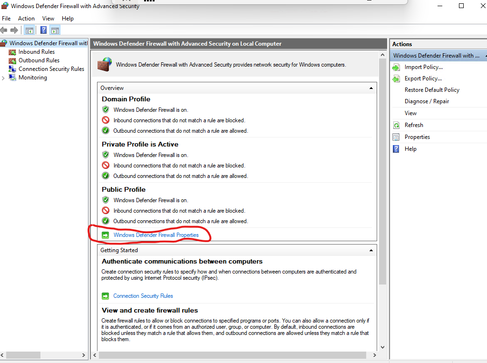

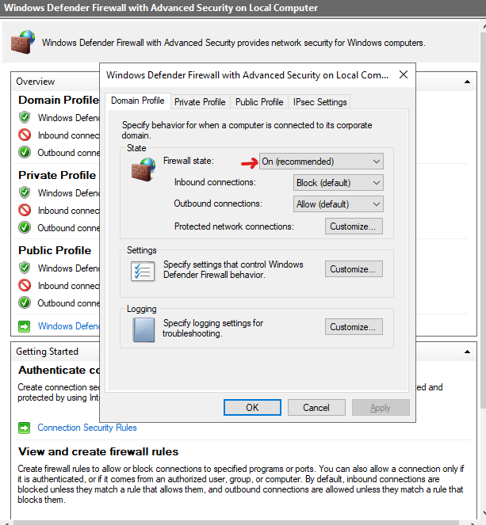

### **Ping the VM to local Computer**

From your local machine. Use CMD or PowerShell to ping the VM. We have to make sure its accessible on the internet.

```powershell
ping -n 6 20.64.238.22
```
Pings the VM and a total of 6 packets sent and received

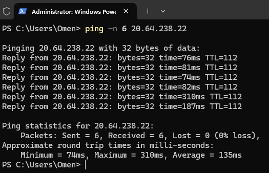

### **Step 6: Set-up Log Analytics Workspace & Microsoft Sentinel**
By default the VM keeps all the Security Events in 'Event Viewer' - Windows Logs - Security.
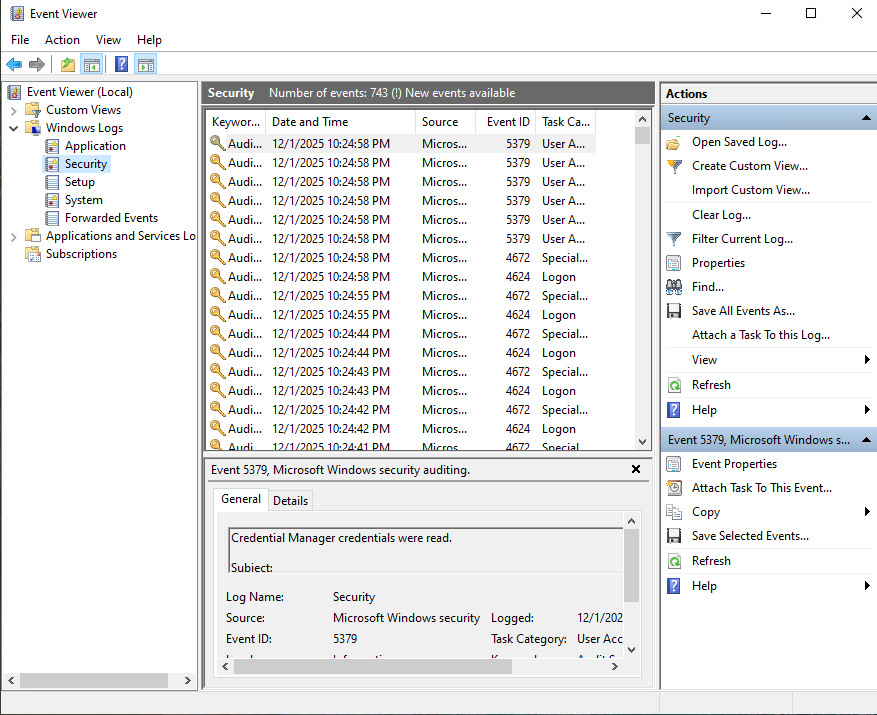
Each ID corresponds to a security events and an ID search can be used to filter logs (e.g. For failed logs search (Ctrl + F or 'Filter current log..') for '4625')

**Configure a Log Repository**
To collect and analyze these logs in Microsoft Sentinel, we need to set up a Log Analytics Workspace and enable Microsoft Sentinel (SIEM).

<ul style="font-size:80%">
  <li>AZURE: Create 'Log Analytics workspace'</li>
    <ul>
        <li>Resource group: H-SOC-Lab</li>
        <li>Name: Log-SOC-lab</li>
        <li>Region: East US 2</li>
        <li>Review & Create</li>
    </ul>
      </li>
</ul>

**Create Microsoft Sentinel Instance**

<ul style="font-size:80%">
  <li>AZURE: Create 'Microsoft Sentinel'</li>
    <ul>
        <li>Select the Log Analytics workspace: Log-SOC-lab</li>
        <li>Add</li>
    </ul>
      </li>
</ul>

**Configure the Connection between VM and Log Analytics**

<ul style="font-size:80%">
  <li>AZURE: 'Microsoft Sentinel'</li>
    <ul>
        <li>Content Management</li>
        <li>Content Hub</li>
        <li>Search: Windows Security Events</li>
        <li>Select & Install: Windows Security Events</li>
    </ul>
      </li>
</ul>

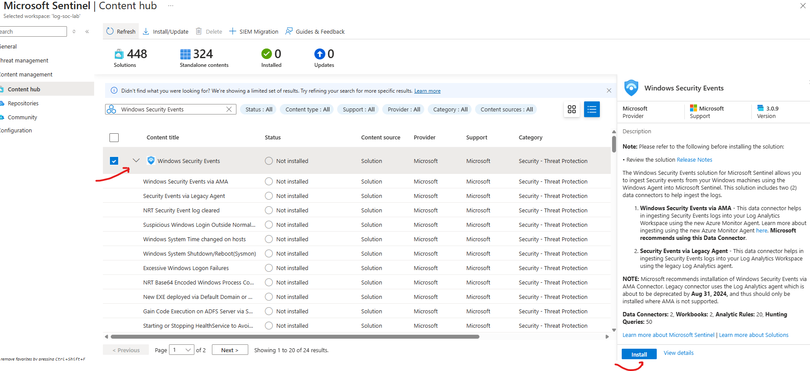

**Manage Windows Security Events via Azure Monitoring Agent (AMA)**
<ul style="font-size:80%">
  <li>AZURE: 'Microsoft Sentinel'</li>
    <ul>
        <li>Configuration</li>
        <li>Click on Manage - Windows Security Events</li>
        <li>Check and Install the Windows Security Events via AMA</li>
    </ul>
      </li>
</ul>

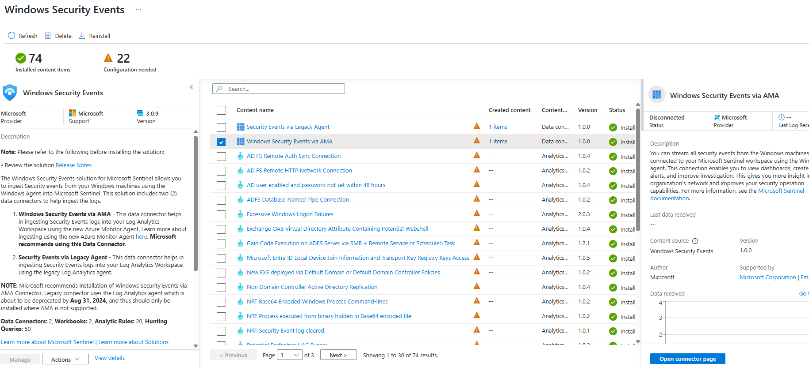

<ul style="font-size:80%">
  <li>AZURE: 'Microsoft Sentinel': Windows Security Events via AMA</li>
    <ul>
        <li>Open connector page</li>
        <li>+Create data collection rule</li>
        <li>Check and Install the Windows Security Events via AMA
        <ul>
            <li>Configuration</li>
            <li>Rule name: Mag-Windows</li>
            <li>Resource group: H-SOC-Lab</li>
        </ul></li>
        <li>Next: Resources<ul>
            <li>Expand 'Azure Subscription, then RG and select the resource group and VM</li>
        </ul></li>
        <li>Next: Collect all security events</li>
        <li>Next: & Create</li>
    </ul>
      </li>
</ul>

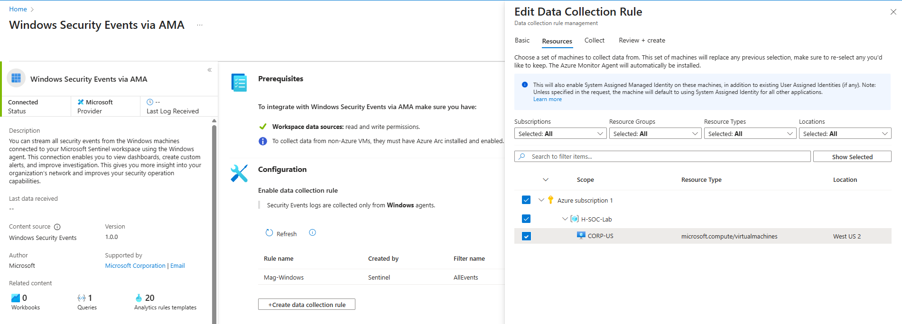      

### **Step 7: Monitor Attacks in Microsoft Sentinel**

<ul style="font-size:80%">
  <li>AZURE: 'Log Analytics workspaces'</li>
    <ul>
        <li>Select the Sentinel : Log-SOC-lab</li>
        <li>Select: Logs > Table > SecurityEvents</li>
        <li>To Use KQL queries: Logs > Queries > (top right: change from User Mode to KQL mode)</li>
    </ul>
      </li>
</ul>

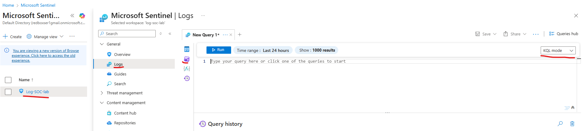


### **Example KQL Queries to Monitor Attacks**
```kql
// Failed RDP Log-in Attempts (Event ID: 4625)
SecurityEvent
| where EventID == 4625
| summarize Count = count() by Account, IpAddress, bin(TimeGenerated, 1h)
| order by Count desc
```

```kql
// All RDP Log-in Attempts (Successful and Failed)
SecurityEvent
| where EventID in (4624, 4625)
```

```kql
// Targeted Specific Account e.g. "administrator "
SecurityEvent
| where Account == "\\administrator"
```

```kql
// Top Targeted Accounts by Failed Log-ins
SecurityEvent
| where EventID == 4625
| summarize FailedAttempts = count() by Account
| order by FailedAttempts desc
```


```kql
// Successful RDP Log-in Attempts (Event ID: 4624)
SecurityEvent
| where EventID == 4624
| summarize Count = count() by Account, IpAddress, bin(TimeGenerated, 1h)
| order by Count desc
```
```kql
// Top Source IPs by Failed Log-ins
SecurityEvent
| where EventID == 4625
| summarize FailedAttempts = count() by IpAddress
| order by FailedAttempts desc
| take 10
```

```kql
// Brute-force Attack Patterns
SecurityEvent
| where EventID == 4625
| summarize Attempts = count() by IpAddress, bin(TimeGenerated, 10m)
| where Attempts > 5
| order by Attempts desc
```

```kql
// Geo-location of Attackers
SecurityEvent
| where EventID == 4625
| extend GeoInfo = iplocation(IpAddress)
| summarize Count = count() by GeoInfo.CountryOrRegion
| order by Count desc
```

**Geo-location of Attackers**
<ul style="font-size:80%">
  <li>Add Geographic Data to resolve IpAddresses to Physical Location</li>
  <li> Import a spreadsheet which contains geographic information for each block of IP addresses (as a "Sentinel Watchlist").

Download: <a herf="https://raw.githubusercontent.com/joshmadakor1/lognpacific-public/refs/heads/main/misc/geoip-summarized.csv" target="_blank"> geoip-summarized.csv</a>
</li>
  <li>Azure: search: Microsoft Sentinel > select: Configuration > select:  watchlist > + New</li>
  <li>Watchlist wizard - General
    <ul>
      <li>Name: geoip</li>
      <li>Alias: geoip</li>
    </ul>
  </li>
  <li>Watchlist wizard - Source
    <ul>
      <li>Source type: local file</li>
      <li>File type: csv with header</li>
      <li>Upload file: upload the downloaded file 'geoip-summarized.csv'</li>
      <li>SearchKey: network</li>
      <li>Review & Create</li>
    </ul>
  </li>
</ul>
- to see our uploaded watchlist using kql
  
```kql
_GetWatchlist("geoip")
```

**See where the attacks are coming from**

```kql
let GeoIPDB_FULL = _GetWatchlist("geoip");
let WindowsEvents = SecurityEvent
    | where IpAddress == <attacker IP address> // Replace Ip address "147.91.111.100"
    | where EventID == 4625
    | order by TimeGenerated desc
    | evaluate ipv4_lookup(GeoIPDB_FULL, IpAddress, network);
WindowsEvents

```


## Attack Map Creation

<ul style="font-size:80%">
  <li>AZURE: 'Create Sentinel Workbook'</li>
    <ul>
        <li>Select the Sentinel : Log-SOC-lab > Threat Management > Workbooks > + Add Workbook > Edit > (use 3 dots to remove all content)</li>
    </ul>
      </li>
  <li>Add > add query > Advanced editor (delete and paste the json code below) > Done editing</li>
</ul>

```json
{
	"type": 3,
	"content": {
	"version": "KqlItem/1.0",
	"query": "let GeoIPDB_FULL = _GetWatchlist(\"geoip\");\nlet WindowsEvents = SecurityEvent;\nWindowsEvents | where EventID == 4625\n| order by TimeGenerated desc\n| evaluate ipv4_lookup(GeoIPDB_FULL, IpAddress, network)\n| summarize FailureCount = count() by IpAddress, latitude, longitude, cityname, countryname\n| project FailureCount, AttackerIp = IpAddress, latitude, longitude, city = cityname, country = countryname,\nfriendly_location = strcat(cityname, \" (\", countryname, \")\");",
	"size": 3,
	"timeContext": {
		"durationMs": 2592000000
	},
	"queryType": 0,
	"resourceType": "microsoft.operationalinsights/workspaces",
	"visualization": "map",
	"mapSettings": {
		"locInfo": "LatLong",
		"locInfoColumn": "countryname",
		"latitude": "latitude",
		"longitude": "longitude",
		"sizeSettings": "FailureCount",
		"sizeAggregation": "Sum",
		"opacity": 0.8,
		"labelSettings": "friendly_location",
		"legendMetric": "FailureCount",
		"legendAggregation": "Sum",
		"itemColorSettings": {
		"nodeColorField": "FailureCount",
		"colorAggregation": "Sum",
		"type": "heatmap",
		"heatmapPalette": "greenRed"
		}
	}
	},
	"name": "query - 0"
}
```
- Paste the json code inside the query window

- Save the Map generated

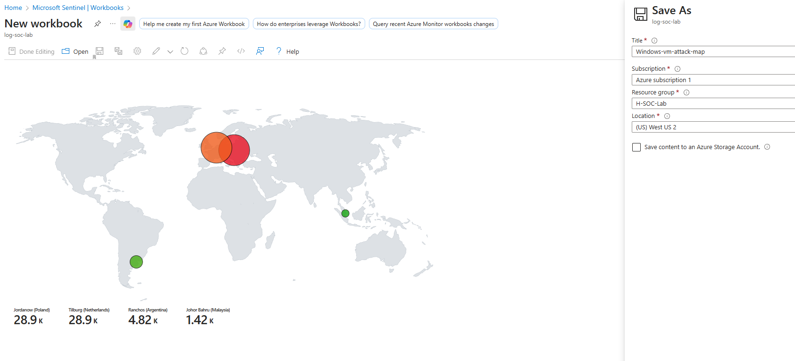


### **Step 8: Visualize Attacks with Dashboards**
<!-- <ul style="font-size:80%">
  <li>AZURE: 'Microsoft Sentinel'</li>
    <ul>
        <li>Dashboards</li>
        <li>+Create dashboard</li>
        <li>Name: Honeypot Attack Monitoring</li>
        <li>Add new tile
        <ul>
            <li>Query tile</li>
            <li>Enter KQL query (e.g., Failed RDP Log-in Attempts)</li>
            <li>Visualization type: choose (e.g., Bar Chart)</li>
            <li>Apply</li>
        </ul></li>
    </ul>
      </li> -->

---